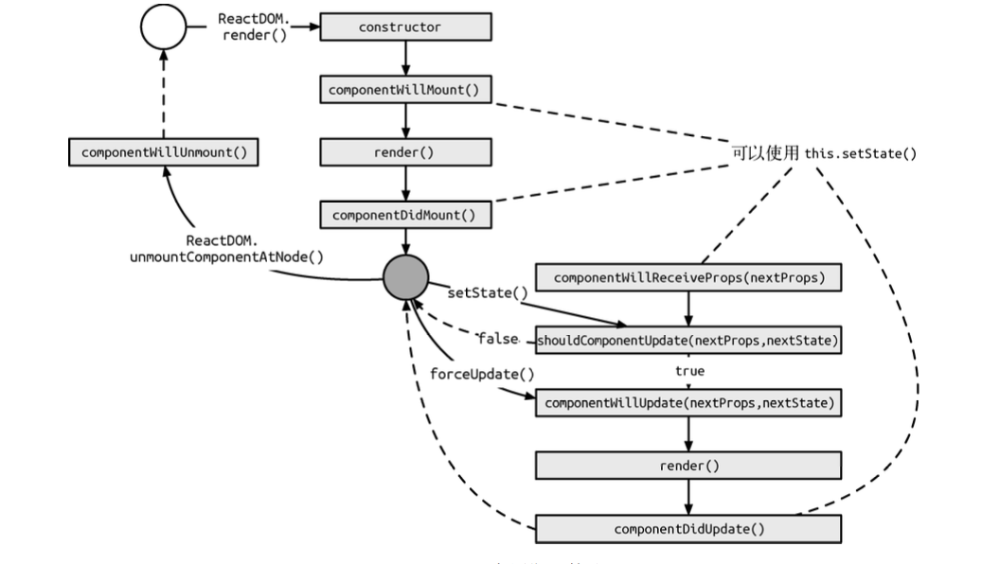

# React 生命周期

我们可以把React的生命周期分成两类：
1. 当组件在挂载或卸载时
2. 当组件接收新的数据时，即组件更新时（父组件向下传递 props 或组件自身执行 setState 方法时发生的一系列更新动作）


## 挂载或者卸载过程

### 组件的挂载

```javascript
import React,{ Component } from 'react';

class App extends Component {
    static propTypes = {

    };
    static defaultProps = {

    };

    constructor(props) {
        super(props);
        this.state = {

        }
    }

    componentWillMount() {

    }

    componentDidMount() {

    }

    render() {
        return (<div>This is a demo</div>);
    }
}
```

### 组件的卸载

```javascript
import React, {Component} from 'react';
class App extends Component {
    componentWillUnmount() {

    }
    render() {
        return (<div>This is a demo</div>);
    }
}
```

组件的挂载和卸载只会执行一次

在`componentWillMount`中执行`setState`，组件状态会更新，但是只会执行一次，应该在构造函数中设置组件的初始状态


如果我们在 componentDidMount 中执行 setState 方法，又会发生什么呢?组件当然会再次更 新，不过在初始化过程就渲染了两次组件，这并不是一件好事。但实际情况是，有一些场景不得不需要 setState，比如计算组件的位置或宽高时，就不得不让组件先渲染，更新必要的信息后， 再次渲染。
在 componentWillUnmount 方法中，我们常常会执行一些清理方法，如事件回收或是清除定时器。

## 数据更新

```javascript
import React, { Component } from 'react';

class App extends Component {
    componentWillReceiveProps(nextProps) {
        // this.setState()
    }
    shouldComponentUpdate(nextProps, nextState) {
        // return true
    }
    componentWillUpdate() {

    }
    componentDidUpdate() {

    }
    render() {
        return (<div>This is a demo</div>);
    }
}
```

如果是组件state发生改变，会依次执行`shouldComponentUpdate`、 `componentWillUpdate` 、`render` 和 `componentDidUpdate`

如果组件是由父组件更新 props 而更新的，那么在 `shouldComponentUpdate` 之前会先执行 `componentWillReceiveProps` 方法。此方法可以作为 React 在 props 传入后，渲染之前 setState 的机会。在此方法中调用 setState 是不会二次渲染的。

## 整体流程



> 可以使用setState的地方

> 1. `componentWillMount`初始化时，组件状态会更新，但是只会执行一次，应该在构造函数中设置组件的初始状态。
 
> 2. `componentDidMount`会再次渲染，以更新的模式再次渲染 

> 3. `componentWillReceiveProps`不会再次渲染，在接受到props，同时修改state的机会 

> 4. `componentDidUpdate`再次更新渲染
