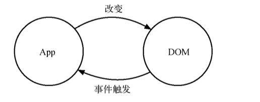
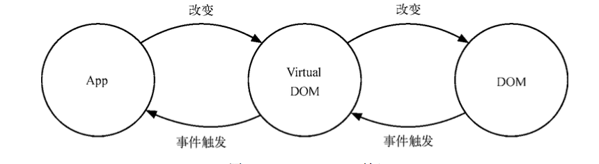

# react 入门

和 Angular、 Ember 等框架不同，React 并不是完整的 MVC/MVVM 框架，它专注于提供清晰、简洁的 View (视图)层解决方案。而又与模板引擎不同，React 不仅专注于解决 View 层的问题，又是一个包 括 View 和 Controller 的库。

## virtual DOM



DOM 操作非常昂贵。我们都知道在前端开发中，性能消耗最大的就是 DOM 操作，而且这 部分代码会让整体项目的代码变得难以维护。React 把真实 DOM 树转换成 JavaScript 对象树，也 就是 Virtual DOM。



每次数据更新后，重新计算 Virtual DOM，并和上一次生成的 Virtual DOM 做对比，对发生 变化的部分做批量更新。React 也提供了直观的 shouldComponentUpdate 生命周期回调，来减少数 据变化后不必要的 Virtual DOM 对比过程，以保证性能。

## JSX

javascript代码中写html代码

```javascript
var names = ['Alice', 'Emily', 'Kate'];

ReactDOM.render(
  <div>
  {
    names.map(function (name) {
      return <div>Hello, {name}!</div>
    })
  }
  </div>,
  document.getElementById('example')
);
```

## 组件

```

var HelloMessage = React.createClass({
  render: function() {
    return <h1>Hello {this.props.name}</h1>;
  }
});

ReactDOM.render(
  <HelloMessage name="John" />,
  document.getElementById('example')
);
```