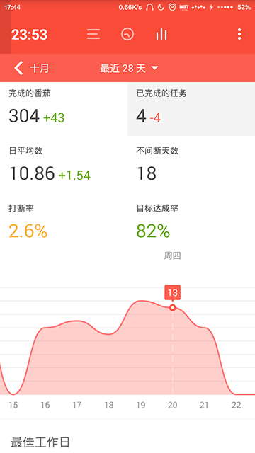
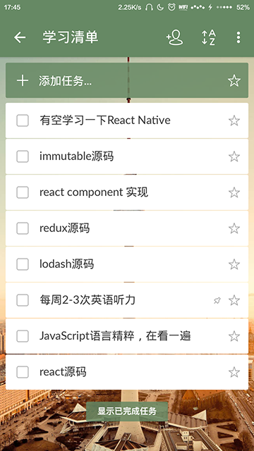

# 程序员如何提高工作效率？我是这样做的...

当前，互联网从业者的压力越来越大，对程序员来说尤甚。很多程序员都是朝九晚九，但我发现大多数时候都是工作效率的问题。每隔两分钟看一会儿手机，有人发微信给你，有人打电话给你，有人朋友圈留言...。每次拿起手机来，就放不下手，等放下的时候，已经半个小时过去了（我明明只玩了一会啊）

我自从今年下半年开始，慢慢开始注意自己的工作效率，现在有了显著的提高，别人写一个功能的时候，我都做了两三个了。提高工作效率我是这样做的：

1. 上班时间手机开启“勿扰模式”

    很多人一看到这条可能第一反应“这怎么可能？万一有人找呢？有急事怎么办？”。其实，我可以明确的说，这没有任何问题，我作为一个纯纯的程序媛，平时接的电话，80%以上都是各种推销、保险、400等等电话，上班的时候很少有人给我打必须接的电话。而且作为一个不太爱说话的物种，接这种电话和他们白扯简直烦死了，而且还不太好意思直接挂掉。自从我不接电话以来，类似于这种电话，我发现给我打的频率越来越少，刚开始的时候一天有几个，后来慢慢发展到几天一个了，现在几乎都没有了。但是万一有重要的事情怎么办？我现在使用的是番茄工作法（下面会讲），每隔25分钟休息一下，发现有重要来电，我就会在这个时候给他回电。
    
2. 番茄工作法
    
    刚听到番茄工作法的时候，我很排斥，觉得根本行不通，程序员这种需要专注的工作怎么可能用这种工作法呢？后来的事实推翻了我的结论，我突然发现这个方法真的很不错。现在我使用“番茄时钟”APP，每隔25分钟休息5分钟，每完成4个番茄休息有一个长休息，现在我每天至少完成12个番茄，大多数时候都是14个番茄。几乎每个番茄的时间内我都只在敲代码，这样算下来，我每天有7个小时都在全心全意的工作（手动点赞）。我刚开始觉得25分钟好短，不利于程序员思考，后来我发现，其实如果你在这25分钟内一直思考的话，其实会感到疲劳，而且如果你已经思考了这么长时间了，往下其实很难有进展，还不如停下了换一下思维，五分钟以后可能有全新的认识呢。如果觉得时间太短的话，可以按照自己的习惯去调节。我使用的APP还有在番茄时间内屏蔽应用的功能，我几乎把手机的应用都屏蔽掉了，所以每次工作的时候，都不会玩手机，都在认真工作。（以前，一拿起手机，再放下，我的天呢，半个小时过去了，这样哪有什么效率而言呢？）

    
    
    

    上图是我最近常用的标签和最近工作的统计。

3. 列工作清单
    
    给自己列一个工作/学习清单，给每个任务设置一个完成时间，每完成一个任务勾一下。每天早上开始工作之前先总结一下昨天的工作，再列一下今天的工作。我之前也不用TODOList，后来可能是年纪大了，好多要做的事情转眼就忘了，尤其做Web开发，小的功能点又特别碎。有一段时间尝试使用列工作清单后，发现这样不仅仅工作效率提高了，而且还很有成绩感。我现在的工作/学习都会给自己列一个清单，来督促自己，下图中是我最近的学习清单。

    
    

4. 利用碎片时间+笔记
    
    平时像坐地铁、等公交的时候，我比较喜欢看一些微信公众号分享的博客，有时候用电脑找某些技术问题时，也会看到一些好的博客。一般好的博客，都需要多读几遍，尤其像第一遍虽然一眼看上去觉得很好，但是很多作者分享的概念、技巧都需要慢慢理解，所以大多数情况下还需要保存下来，最近发现一个比较好用的笔记--“为知笔记”，可以在保存微信中的文章，用浏览器看到那篇文章比较好，也可以保存下来，实在是太方便了。

    
    
    
最重要的是，好习惯要坚持下来，不能两天打渔三天晒网！！
就先分享到这里吧，写文章太不容易了，我现在已经进行了三个番茄了。。。
