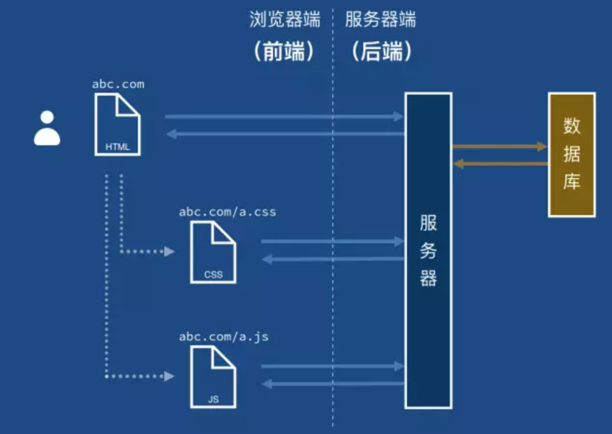
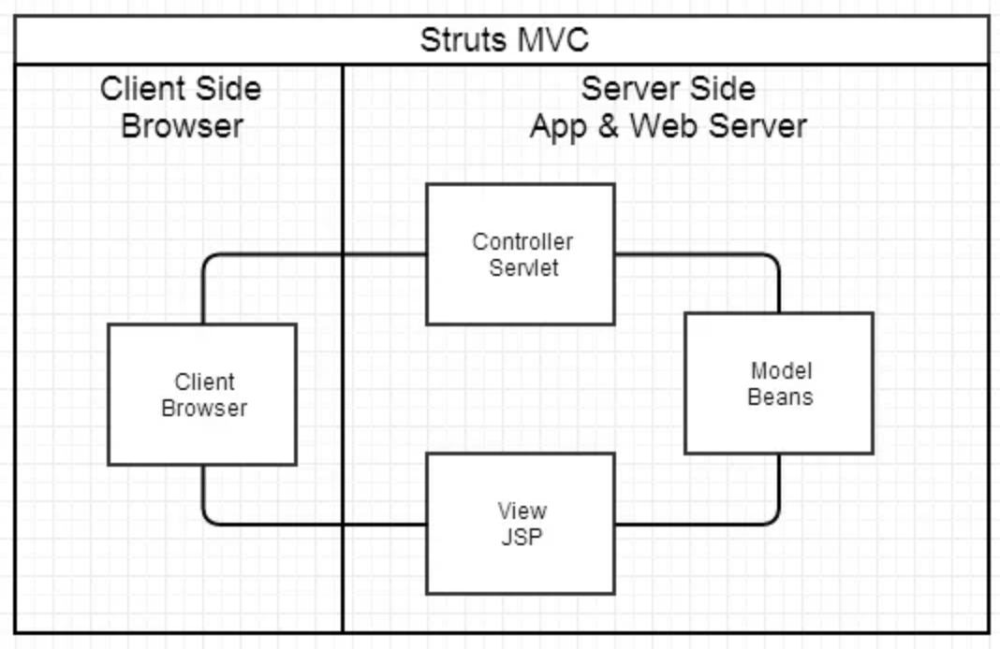
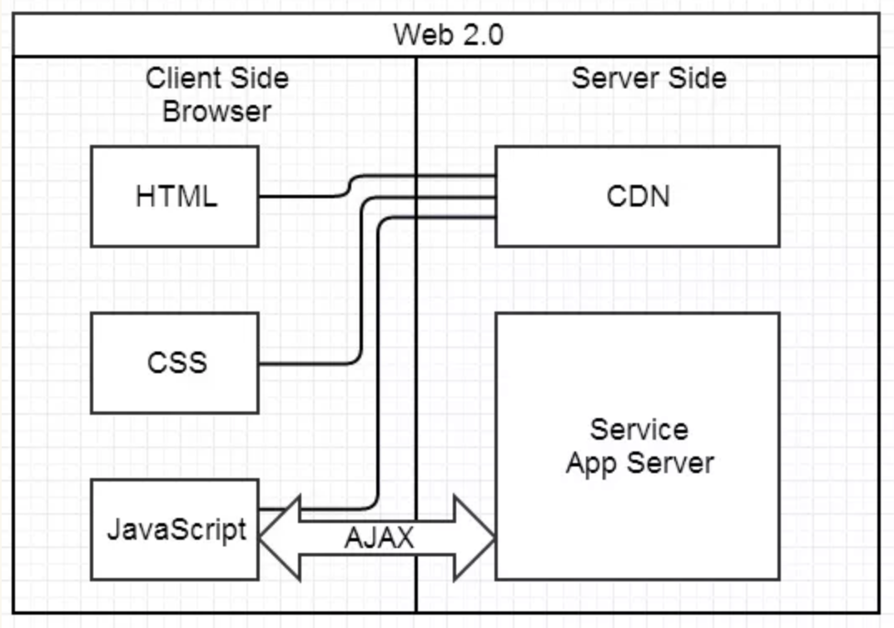

# 给不了解前端的同学讲讲前端

## 前端是什么

	思考一个问题，当在浏览器地址框中输入 `www.baidu.com` 后发生了什么。
	1. dns解析
    2. 得到服务器地址后，向服务器发出请求
    3. 服务器返回请求 index.html
    4. 解析index.html, 发现外部资源 a.css 和 a.js ，向服务器请求资源



    在此过程中后端的局限性：

    1. 服务器一旦把资源提供给浏览器之后，变失去了对内容的想一个
    2. 服务器无法得知用户在浏览器中做了什么，无法与用户交互

    前端的作用：

    1. 在用户没有发起请求的时间内，控制页面内容
    2. 与用户交互

## 前端用到的技术栈

   * html - 结构
   * css - 表现
   * js - 行为
   
   进阶知识
 
   * HTTP协议
   * nodejs
   * 浏览器相关
   * 前端性能优化
   

## 前端的发展历程&框架

### 前后端不分的年代

    代表：jsp
    后端收到浏览器请求，生成静态的页面，发送到浏览器

```jsp
    <html>
    <head>
           <title>第一个 JSP 程序</title>
    </head>
    <body>
           <%
                  out.println("Hello World！");
           %>
    </body>
</html>
```

本质：利用java代码来生成html，服务端渲染，生成静态页面，发送给浏览器显示。

### 后端MVC开发模式

* Model（模型层）：提供/保存数据

* Controller（控制层）：数据处理，实现业务逻辑

* View（视图层）：展示数据，提供用户界面

好处：代码可维护性得到明显好转，MVC是个非常好的协作模式，从架构层面让开发者懂得什么代码应该写在什么地方。为了让 View 层更简单干脆，还可以选择 Velocity、Freemaker 等模板，使得模板里写不了 Java 代码。看起来是功能变弱了，但正是这种限制使得前后端分工更清晰

本质：前端只是后端 MVC 的 V。

### ajax

自此开始前端不在是后端的模板，前端开始拥有获取数据的功能。


### 前端为主的MV*框架

#### Backbone(MV框架)

Backbone 将前端代码分成两个基本部分。

* Model：管理数据

* View：数据的展现

#### Angular、Vue(MVVM框架)

另一些框架提出 MVVM 模式，用 View Model 代替 Controller。

* Model

* View

* View-Model：简化的 Controller，唯一作用就是为 View 提供处理好的数据，不含其他逻辑。

本质：view 绑定 view-model，视图与数据模型强耦合。数据的变化实时反映在 view 上，不需要手动处理。

```javascript
<div ng-app="">
  <p>
    姓名 :
    <input type="text" ng-model="name" placeholder="在这里输入您的大名">
  </p>
  <h1>你好，{{name}}</h1></div>
```

### React（V层)

### redux + react (MVC)


